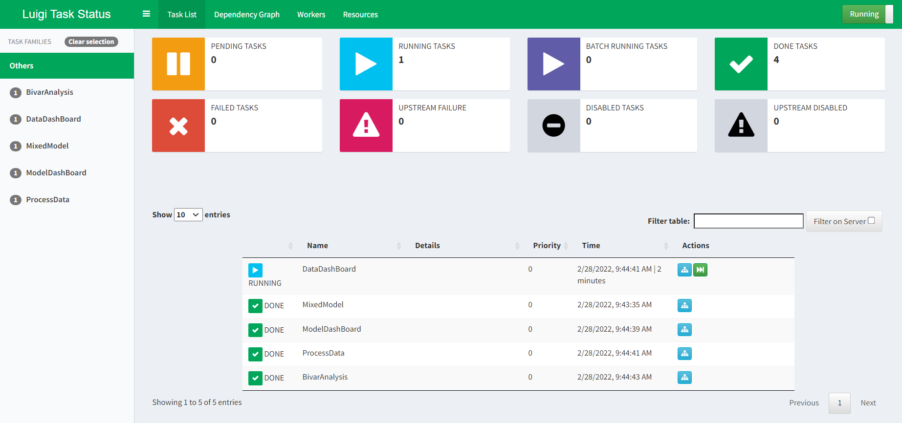
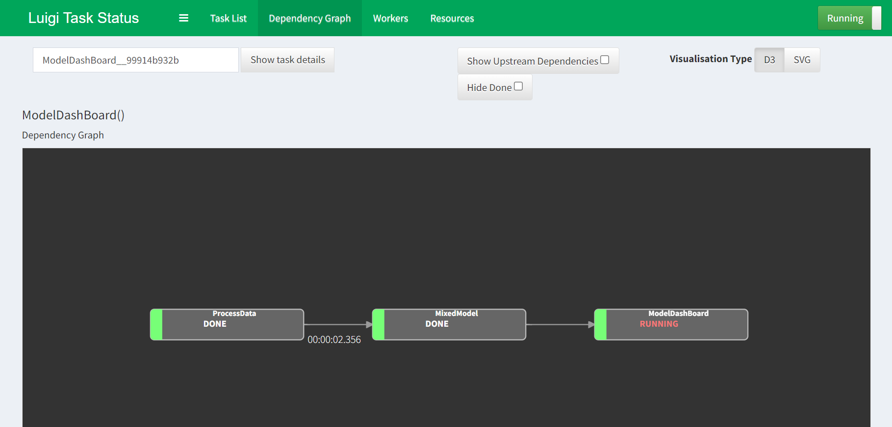
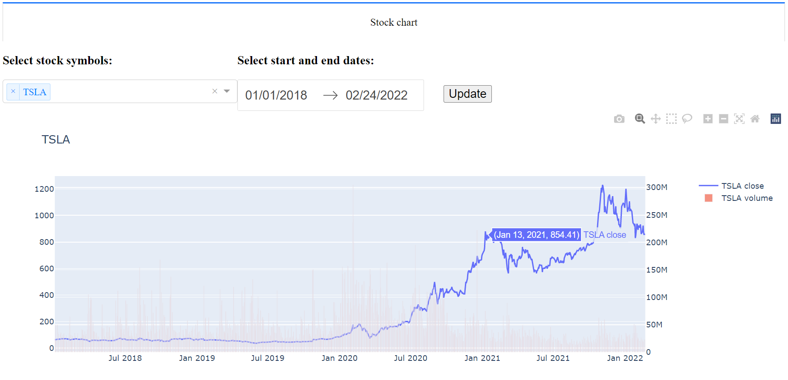
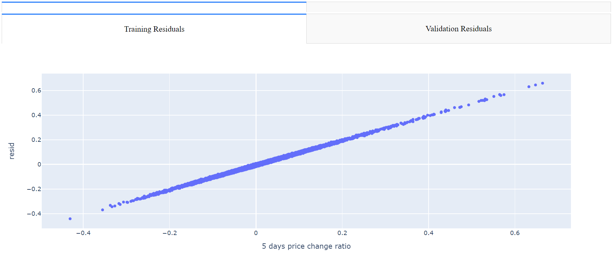

# Stock Analysis
> This project builds a pipeline to automatically update and analyze stock. It manages the whole data processing, analyzing and modeling through Luigi and demonstrates the results through Python Dash and other methods.

## Table of Contents
* [General Info](#general-information)
* [Technologies Used](#technologies-used)
* [Features](#features)
* [Screenshots](#screenshots)
* [Setup](#setup)
* [Usage](#usage)
* [Project Status](#project-status)
* [Room for Improvement](#room-for-improvement)

## General Information
- Provide general information about your project here.
- What problem does it (intend to) solve?
- What is the purpose of your project?
- Why did you undertake it?

## Technologies Used
- Python 3.0
- Statistical and machine learning
  - Linear regression
  - Mixed model
  - XGBoost (upload soon)
  - ARIMA (upload soon)
  - LSTM (upload soon)
- Luigi
- Python Dash

## Work flow
- Data processing
  - Data extraction
  - Feature engineering
- Model building
- Model evaluation
- Visualization

## Screenshots
- Luigi management

- Stock chart

- Residual plots   
Apparently the model results are not good enough.

## Setup
1. Clone the Github
2. Install the necessary packages

## Usage
1. Run: luigid --port 8082 in a terminal. This command line will start a Luigi. 
2. Run: python stock_analysis_pipeline.py in the stock_analyis folder
3. Look at:
   - Luigi at localhost:8082;
   - stock chart at localhost:8050;
   - model evaluation at localhost:8000

## Project Status
Project is: _in progress_. 

## Room for Improvement

Room for improvement:
- Upload requirement.txt to help the installation
- Upload the XGBoost code for Luigi
- Upload the ARIMA code for Luigi
- Upload the LSTM code for Luigi

To do:
- Add more model evaluation methods

